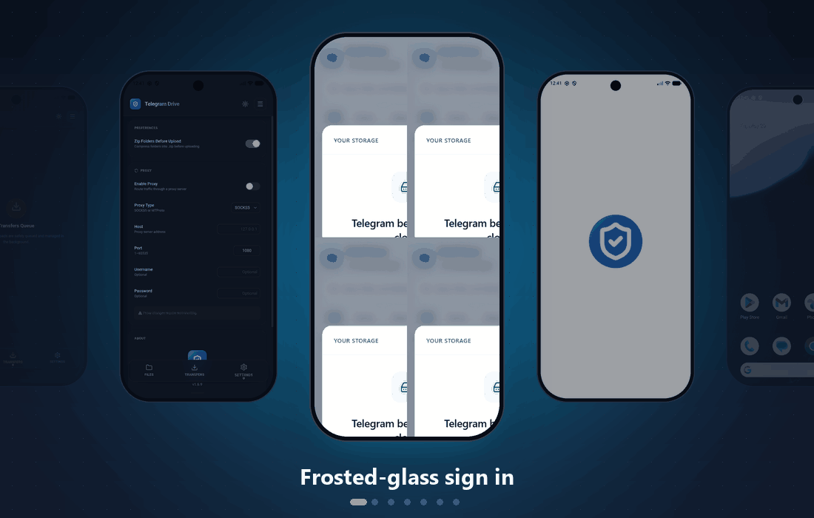
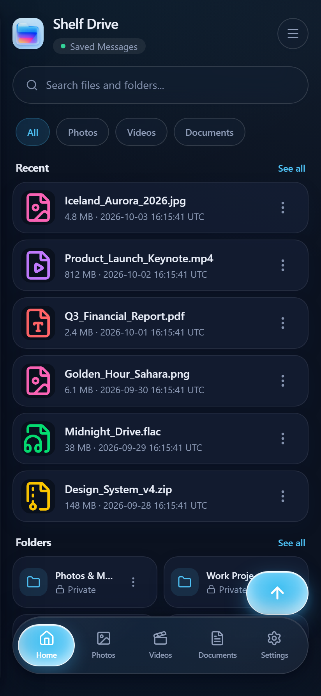
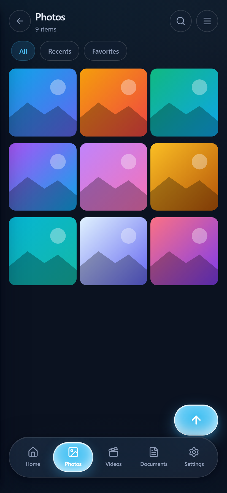
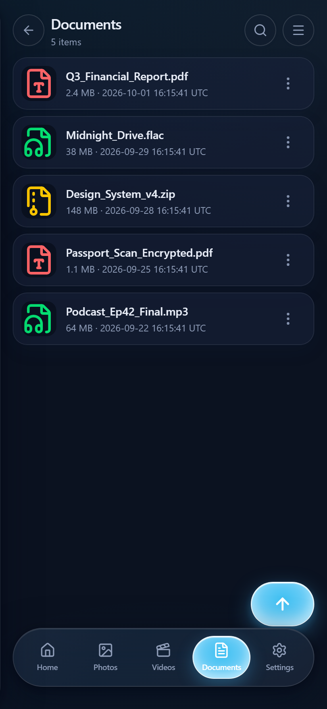
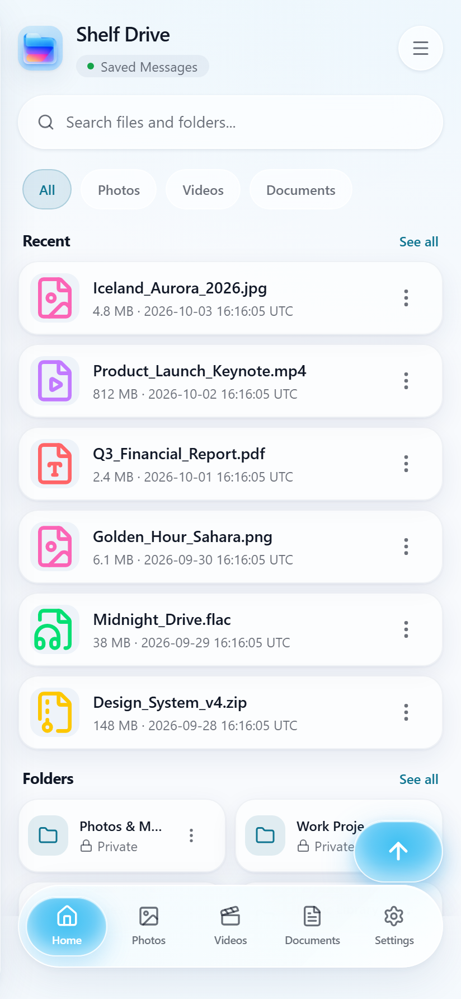
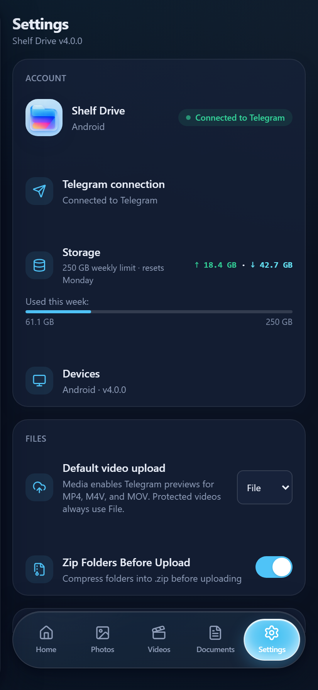
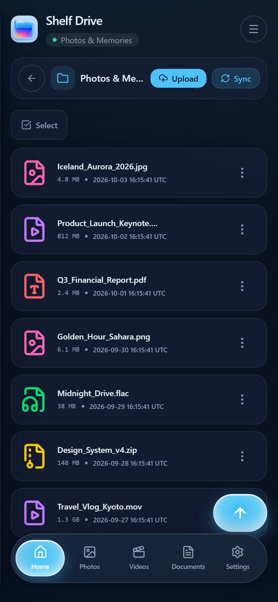
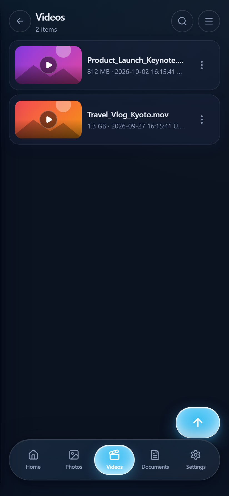
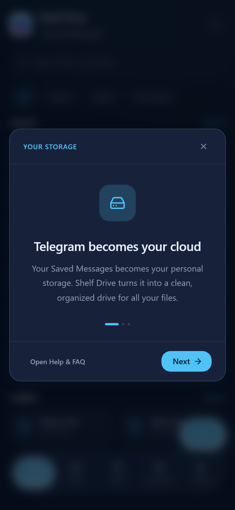

<p align="center">
  
</p>

<p align="center">
  <a href="https://github.com/hellocloudwebdev/shelf-drive-mobile/releases/latest"></a>
  <a href="https://github.com/hellocloudwebdev/shelf-drive-mobile/blob/main/LICENSE"></a>
  <a href="https://github.com/hellocloudwebdev/shelf-drive-mobile/actions"></a>
</p>

<p align="center">
  
  
  
  
  
  
  
  
</p>

<p align="center">
  <a href="https://github.com/hellocloudwebdev/shelf-drive-mobile/stargazers"></a>
  &nbsp;
  <a href="https://github.com/hellocloudwebdev/shelf-drive-mobile/network/members"></a>
</p>

<p align="center">
  <a href="https://readme-typing-svg.demolab.com">
    
  </a>
</p>

<p align="center">
  <a href="#-app-tour"><b>App Tour</b></a> &nbsp;•&nbsp;
  <a href="#at-a-glance"><b>Features</b></a> &nbsp;•&nbsp;
  <a href="#download-android"><b>Download</b></a> &nbsp;•&nbsp;
  <a href="#privacy--security"><b>Security</b></a> &nbsp;•&nbsp;
  <a href="#quick-start"><b>Quick Start</b></a> &nbsp;•&nbsp;
  <a href="#build-from-source-android"><b>Build</b></a> &nbsp;•&nbsp;
  <a href="#tech-stack"><b>Tech</b></a>
</p>

<p align="center">
  
</p>

<p align="center">
  <strong><em>"More than storage — it's your digital shelf."</em></strong>
</p>

<p align="center">
  The mobile home of Shelf Drive — a local-first file workspace powered by your own Telegram account.<br>
  Open-source. Free to use. No third-party servers. Your files never leave your control.
</p>

<p align="center">
  <a href="https://github.com/hellocloudwebdev/shelf-drive-mobile/releases/latest"></a>
</p>

<a id="-app-tour"></a>

<h2 align="center">📱 App Tour</h2>

<p align="center">
  
</p>

<p align="center">
  <sub>Eight real-time screens, one unified frosted-glass identity — captured directly from the live application runtime.</sub>
</p>

<p align="center">
  
</p>

<br>

> **Repository scope:** this repository builds the **Android (phones, tablets, Android TV / Google TV)** application. The Windows, macOS, and Linux desktop applications live in the sibling repository [`hellocloudwebdev/shelf-drive`](https://github.com/hellocloudwebdev/shelf-drive). The application core (`app/src`, `app/src-tauri/src`, tests, and dependency manifests) is intentionally shared between the two repositories and kept in sync — see [Docs/SHARED_CORE_SYNC.md](./Docs/SHARED_CORE_SYNC.md).

---

## 💡 The Idea

> *"Your Saved Messages becomes your personal storage. Shelf Drive turns it into a clean, organized drive for all your files."*
>
> — Shelf Drive Onboarding Tour

Telegram gives every user generous cloud storage through Saved Messages and channels. Shelf Drive transforms that raw storage into a polished, organized workspace — with folders, search, streaming, sync, sharing, and a beautiful frosted-glass interface — all running locally on your device with no relay servers in between.

**Think of it as your personal cloud drive**, except the storage is Telegram's, the app is open-source, and everything runs on your device.

<br>

---

<p align="center">
  
</p>

## At a Glance

| | Feature | What It Does |
|:---:|:---|:---|
| 📁 | **File Management** | Touch-first grid & list views, multi-select, bulk actions, folders, search, sort |
| 🚀 | **Transfers** | Durable upload/download queues that survive restarts, pause/resume, bandwidth controls |
| 🎬 | **Media Streaming** | Built-in video player, audio playback, image preview |
| 📄 | **Document Viewer** | PDF viewer, archive browser (ZIP/RAR/7z), Continue Watching shelf |
| 🔄 | **Folder Sync** | Bidirectional sync between a local directory and a Telegram channel |
| 🔗 | **Sharing** | Password-protected download links, QR codes, Telegram message links |
| 🔐 | **Encryption** | Optional TDENC2 envelope encryption with vault passphrase and recovery bundles |
| 📦 | **Offline Packs** | Download collections for trips — watch and browse without internet |
| 🎨 | **15 Themes** | Dark, light, AMOLED, Nord, Monokai, Forest, Plum, and more — or create your own |
| 🌍 | **24 Languages** | English, Spanish, Russian, Arabic, Hindi, Chinese, Japanese, Korean, and 16 more |
| 📺 | **TV Navigation** | Spatial navigation with remote control support on Android TV / Google TV |
| ♿ | **Accessibility** | WCAG 4.5:1 contrast enforcement, reduced motion support, screen reader tested |

<br>

### 📱 Mobile Experience

The mobile interface features a **frosted glass navigation system** with a 5-tab bottom bar, floating upload button, and fluid gesture-driven interactions — designed from the ground up for touch.

<p align="center">
  
  &nbsp;&nbsp;&nbsp;
  
  &nbsp;&nbsp;&nbsp;
  
</p>

<p align="center">
  <em>Core Mobile Views: Home Dashboard with instant search · Photos Gallery grid · Encrypted Documents Vault</em>
</p>

<br>

<h4 align="center">🌓 Dark Mode vs. Light Mode</h4>

<p align="center">
  
  &nbsp;&nbsp;&nbsp;&nbsp;
  
  &nbsp;&nbsp;&nbsp;&nbsp;
  
</p>

<p align="center">
  <em>Fluid theme engine: Dark AMOLED · Pristine Light · 15 adaptive palettes with system preference sync</em>
</p>

<br>

<details>
<summary><strong>📸 View More Live Application Screens (Folders, Video Player &amp; Onboarding)</strong></summary>
<br>

| Folder View &amp; 2-Way Sync | 4K Video Streaming | Storage Telemetry | Onboarding Experience |
|:---:|:---:|:---:|:---:|
|  |  |  |  |

<p align="center">
  <em>All screenshots captured live from the running mobile runtime with real interactive UI states.</em>
</p>

</details>

<br>

---

<p align="center">
  
</p>

## Download (Android)

Shelf Drive for Android is distributed as a **signed, sideloaded APK** — not through Google Play.

| Platform | Download | Notes |
|:---|:---|:---|
| **Android** | [Latest release](https://github.com/hellocloudwebdev/shelf-drive-mobile/releases/latest) | Android 7.0+ (API 24); universal APK also runs on tablets |
| **Android TV / Google TV** | Same APK | Spatial navigation with remote control support |

### Sideload Install

1. Download `ShelfDrive_<version>.apk` from the [latest release](https://github.com/hellocloudwebdev/shelf-drive-mobile/releases/latest).
2. Open the APK on your device and accept the **install from unknown sources** prompt for your browser or file manager.
3. Launch Shelf Drive and sign in with your Telegram API credentials.

Every release APK is signed with a pinned release keystore and verified in CI before publication. The full runbook — including the signing-certificate fingerprint and manual verification steps — lives in [Docs/ANDROID_SIDELOAD_RELEASE.md](./Docs/ANDROID_SIDELOAD_RELEASE.md).

### In-App Updates

The app ships its own sideload update channel: on launch it fetches a **minisign-signed update manifest** (`android-update.json` + `.sig`) from this repository's releases, verifies the signature against a public key embedded in the app, checks the SHA-256 digest of the downloaded APK, and hands the verified file to Android's package installer. Updates never come from an unverified source.

<br>

---

<p align="center">
  
</p>

## Privacy & Security

> *"Private folders, built in. Shelf Drive uses private Telegram channels to keep your folders organized and accessible only to you."*
>
> — Shelf Drive Onboarding Tour

Shelf Drive is built with a **zero-trust, local-first architecture**:

- 🔒 **No relay servers** — Your files travel directly between your device and Telegram's servers via MTProto encryption. No third-party infrastructure touches your data.
- 🎧 **Encrypted streaming** — TDENC2-protected audio, video, and PDF content can stream.
- 🗝️ **Credentials stay local** — Your API hash is stored in the Android Keystore-backed secure store. It never leaves your device.
- 🛡️ **Optional encryption** — Enable TDENC2 envelope encryption to add a vault passphrase on top of Telegram's built-in encryption. Per-file passphrases and recovery bundle export are supported.
- 📜 **Open source** — Every line of code is auditable. The Rust backend, React frontend, and all IPC boundaries are fully transparent.
- 🔏 **Signed updates** — Android release artifacts are signed, and the sideload update manifest is minisign-verified with a key embedded in the app before installation.
- 🚫 **No analytics by default** — Crash reporting is opt-in only, with a clear consent dialog on first launch.

For the full security policy, see [SECURITY.md](./SECURITY.md). For the privacy policy, see [PRIVACY.md](./PRIVACY.md).

<br>

---

<p align="center">
  
</p>

## Quick Start

1. Install the APK ([Download](#download-android) above)
2. Get a free Telegram API ID from [my.telegram.org](https://my.telegram.org) → **API development tools**
3. Enter your **API ID** and **API Hash** on the welcome screen
4. Authenticate with your Telegram account (phone number + code)
5. You're in! Your Saved Messages files appear automatically.

> 💡 **Tip:** When you first sign in, Shelf Drive shows a guided tour explaining how Telegram storage becomes your organized drive.

<br>

---

## Build From Source (Android)

### Prerequisites

- [Node.js](https://nodejs.org/) v20+
- [Rust](https://www.rust-lang.org/tools/install) (stable toolchain) with Android targets:
  `aarch64-linux-android`, `armv7-linux-androideabi`, `i686-linux-android`, `x86_64-linux-android`
- Android SDK + NDK (NDK r30, e.g. `30.0.14904198`) with `NDK_HOME` / `ANDROID_NDK_HOME` set
- JDK 17
- Git

```bash
# Clone the repository
git clone https://github.com/hellocloudwebdev/shelf-drive-mobile.git
cd shelf-drive-mobile/app

# Install frontend dependencies
npm install

# Generate the Android project (idempotent; keeps existing files)
npm run tauri android init

# Run on a connected device or emulator (hot-reload)
npm run tauri android dev

# Build release APK + AAB for all four architectures
npm run tauri android build -- --target aarch64 armv7 i686 x86_64 --apk true --aab true --ci
```

Release artifacts are packaged and signed by `app/scripts/package-android-release.sh`, which produces the APK/AAB pair, the SHA-256 manifest, and the signed `android-update.json` consumed by the in-app updater.

<br>

---

## Release Flow

Releases are tag-driven: pushing a `v*` tag runs [`.github/workflows/release.yml`](./.github/workflows/release.yml), which

1. runs the verification gates (frontend tests, build, Rust tests, clippy, i18n),
2. invokes [`android.yml`](./.github/workflows/android.yml) to build and sign the APK/AAB for all four Android architectures and exercise the emulator test suite,
3. validates and attaches the signed artifacts to a draft release,
4. generates the source SBOM, checksums, and sigstore provenance attestations,
5. publishes the release only after every gate passes.

<br>

---

## iOS Status: Not Production-Ready

**iOS is explicitly not production-ready and no iOS builds or release claims are made.**

What exists today:

- Rust `#[cfg]` gates in the shared core exclude desktop-only dependencies (unrar, WebDAV server, keyring, single-instance) from iOS compilation targets, and `deny.toml` covers `aarch64-apple-ios` and `aarch64-apple-ios-sim`.
- An `app/src-tauri/icons/ios/` asset set is present in the tree.

What does **not** exist yet: an Xcode project generation + CI pipeline, iOS capability/entitlement validation, signing infrastructure, or any tested device build. Building for iOS additionally requires macOS with Xcode. Treat everything iOS-related as preparation only until it is announced here.

<br>

---

## Tech Stack

| Layer | Technology | Purpose |
|:---|:---|:---|
| **Frontend** | React 19, TypeScript 5.8, Tailwind CSS 4 | UI components and styling |
| **Animations** | Framer Motion | Smooth transitions and gestures |
| **State** | TanStack Query, React Context | Server state and app state |
| **Bundler** | Vite 7 | Fast builds and hot module replacement |
| **Mobile Framework** | Tauri 2 (Android) | Native Android container with web frontend |
| **Backend** | Rust (Tokio async runtime) | High-performance local services |
| **Telegram** | Grammers (MTProto client) | Direct Telegram API communication |
| **Database** | SQLite | File metadata and workspace state |
| **Encryption** | XChaCha20-Poly1305 + Argon2 | Optional file-level encryption |
| **Internationalization** | i18next | 24-locale support with RTL |
| **Testing** | Vitest, Testing Library, Android emulator suite | Unit, integration, and on-device tests |

<br>

---

## Support the Project

Shelf Drive is **free and open-source**. Every feature works without payment.

If you find it useful, consider a **$5 one-time lifetime supporter license** — it removes sponsor placements and helps fund continued development.

<br>

---

## Contributing

Contributions are welcome! Please feel free to submit issues and pull requests.

Before submitting a PR, make sure the following pass:

```bash
npm run test              # Unit tests (run in app/)
npm run build:verify      # Build + bundle budget check
npm run i18n:check        # Locale validation
cargo check               # Rust library (run in app/src-tauri)
cargo check --target aarch64-linux-android   # Android Rust target
```

<br>

---

## Documentation

| Document | Description |
|:---|:---|
| [Android Sideload Guide](./Docs/ANDROID_SIDELOAD_RELEASE.md) | Install on Android without Play Store; signing and CI secrets |
| [Shared Core Sync](./Docs/SHARED_CORE_SYNC.md) | How shared code stays in sync with the desktop repository |
| [Architecture Freeze](./Docs/ARCHITECTURE_FREEZE.md) | Architecture invariants and review notes |
| [Sync Guide](./SYNC_GUIDE.md) | Bidirectional folder sync configuration |
| [Privacy Policy](./PRIVACY.md) | What data is and isn't collected |
| [Security Policy](./SECURITY.md) | Vulnerability reporting and security model |
| [Changelog](./CHANGELOG.md) | Version history and release notes |

<br>

---

## License

Distributed under the **MIT License**. See [LICENSE](./LICENSE) for more information.

<br>

---

<p align="center">
  <strong>Shelf Drive</strong><br>
  <em>More than storage — it's your digital shelf.</em>
</p>

<p align="center">
  <sub>
    Built by <a href="https://github.com/hellocloudwebdev">hellocloudwebdev</a><br>
    <a href="https://github.com/hellocloudwebdev/shelf-drive-mobile/releases">Releases</a> · <a href="https://github.com/hellocloudwebdev/shelf-drive-mobile/issues">Issues</a> · <a href="https://github.com/hellocloudwebdev/shelf-drive">Desktop repository</a>
  </sub>
</p>

<p align="center">
  <sub>
    <em>"Telegram becomes your cloud. Shelf Drive turns it into a clean, organized drive for all your files."</em><br>
    <em>"Photos, videos, documents, and more — organized, searchable, and available wherever you use Shelf Drive."</em>
  </sub>
</p>
